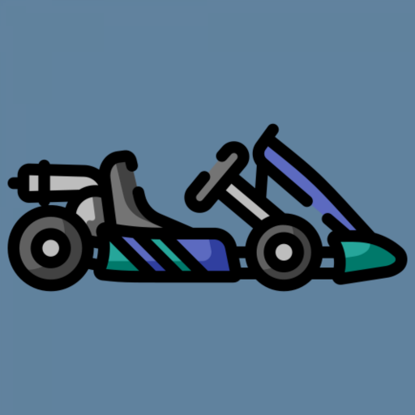

<div align="center">
  
    <h3 align="center">KartHUD</h3>
    <p>An Android app that transforms your device into a dynamic heads-up display for go-karts.</p>
</div>

## Table of Contents

- [🏎️ What is this project?](#-what-is-this-project)
- [🎯 Key Features](#-key-features)
- [🚀 Getting Started](#-getting-started)
- [💙 Contributing](#-contributing)
- [🙏 Credits](#-credits)

## 🏎️ What is this project?

KartHUD is an Android application designed to enhance the go-karting experience by providing real-time telemetry and performance data directly on your smartphone. By leveraging the device's built-in sensors, the app delivers crucial information such as speed, acceleration, and lap times, allowing drivers to monitor their performance without additional hardware.​

## 🎯 Key Features

- **Real-Time Telemetry Display**: Utilizes the Android device's sensors to estimate and present live data, including speed, lateral G-Force, current lap time and session best lap time, offering immediate feedback while driving.

- **Sensor Integration**: Harnesses built-in sensors like GPS (Location) and accelerometers (SensorManager) to gather and display performance metrics without the need for external equipment.​

- **Weather forecast:** Through a connection to OpenWeatherMap and GPS location, temperature data is presented on the HUD to enhance your karting perfomance.

- **Track support**: Track finish line coordinates are provided via Firebase database, so KartHUD can estimate when you complete a lap using your real-time location and computing lines intersection.

- **Historical data**: For each karting session, KartHUD saves and presents your laptimes alonsigde data like track and timestamp.

- **Educational Purpose**: Serves as a practical example of Kotlin, sensor usage, databases and API consuming on an Android app.

## 🚀 Getting Started

Although code can compiled and executed as any other Android App on IDEs like Android Studio, this app depends on a Firebase instance to obtain track data and OpenWeatherMap API key to obtain weather forecast, so you need to obtain a *google-services.json* before compiling and API key respectively.

Expected firebase database schema is something like this example:

```json
{
  "tracks": {
    "Henakart": {
      "beacon1": {
        "latitude": "40.42866992892205",
        "longitude": "-3.4435873082401045"
      },
      "beacon2": {
        "latitude": "40.42861122902229",
        "longitude": "-3.4435209235672506"
      }
    },
    "Los Santos": {
      "beacon1": {
        "latitude": "40.49395295878773",
        "longitude": "-3.2508194021176977"
      },
      "beacon2": {
        "latitude": "40.49397548637385",
        "longitude": "-3.2507341235799108"
      }
    }
  },
  "session_data": {
    "user123": {
      "sessions": {
        "456": {
          "circuit": "TrackName1",
          "startTimestamp": 1685739000000,
          "user": "user123",
          "laps": {
            "789": {
              "time": 65234,
              "timestampStartLap": 1685739200000,
              "sessionId": "456"
            }
          }
        }
      }
    }
  }
}
```

Where *tracks* tree is mandatory and non-editable by app and *session_data* is generated by users.

Local database is modelled as follows:

```text
+---------------------+       1      *     +-------------------+
|      Session        |-------------------<|        Lap        |
+---------------------+                    +-------------------+
| idSession (PK)      |                    | idLap (PK)        |
| track               |                    | time              |
| startTimestamp      |                    | startTimestamp    |
| userId              |                    | session (FK)      |
+---------------------+                    +-------------------+
```

## 💙 Contributing

Any contributions you make are **greatly appreciated**, so if you have any idea of how to make this project better, please [create a pull request](https://github.com/VicDominguez/KartHUD/pulls). Also if you find any bug, please [create an issue](https://github.com/VicDominguez/KartHUD/issues/new).

## 🙏 Credits

This project was originally created by [@VicDominguez](https://github.com/VicDominguez) as a final project of *Advanced Smartphone Programming* course.